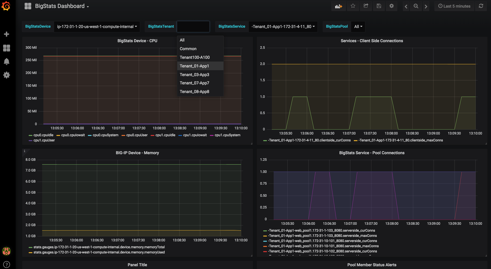

# BigStats_Dashboard-Grafana

Grafana Dashboards for the BigStats telemetry exporter

# Dashboards

```
BigStats - Overview DB
|- Device: CPU
|- Device: RAM
|- Services: Variable
|- Tenant: Variable
|- Pool: variable
```

**Dashboard Overview Diagram**




## Grafana Privisioning

Maybe we should to this? 

http://docs.grafana.org/administration/provisioning/


<!-->